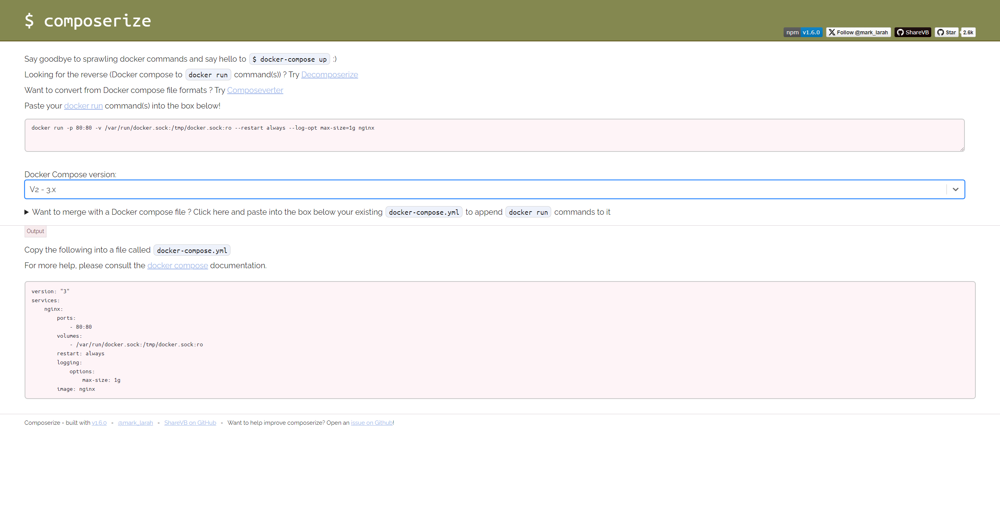

# Composerize

[](https://drone.docker-for-life.de/alcapone1933/docker-composerize)
[](https://drone.docker-for-life.de/alcapone1933/docker-composerize/branches)
[](https://hub.docker.com/r/alcapone1933/composerize/tags)


### FORK

[Composerize](https://github.com/composerize/composerize) , [Decomposerize](https://github.com/composerize/decomposerize) , [Composeverter](https://github.com/outilslibre/composeverter) the original is from github 

#### 3 in 1 [Composerize=Website](https://www.composerize.com/) , [Decomposerize=Website](https://www.decomposerize.com) , [Composeverter=Website](https://www.composeverter.com)

Composerize = http://localhost:80 \
Decomposerize = http://localhost:80/decomposerize \
Composeverter = http://localhost:80/composeverter


#  Docker REPO
https://hub.docker.com/r/alcapone1933/composerize

* * *
### Docker CLI

```bash
docker run -d \
    -p 8080:80 \
    -e TZ=Europe/Berlin \
    --restart always \
    --name composerize \
    alcapone1933/composerize

```

### Docker Compose

```yaml
version: "3.9"
services:
  composerize:
    image: alcapone1933/composerize:latest
    container_name: composerize
    restart: always
    ports:
      - 8080:80
    environment:
      - TZ=Europe/Berlin
```

* * *

## Volume params

| Name    | Value   | Example                    |
|---------|---------|----------------------------|
|  Data   | volume  | composerize_data:/var/www/ |

* * *

## Env params


| Name          | Value     | Example                        |
|---------------|-----------|--------------------------------|
| Timezone      | TZ        | Europe/Berlin                  |





